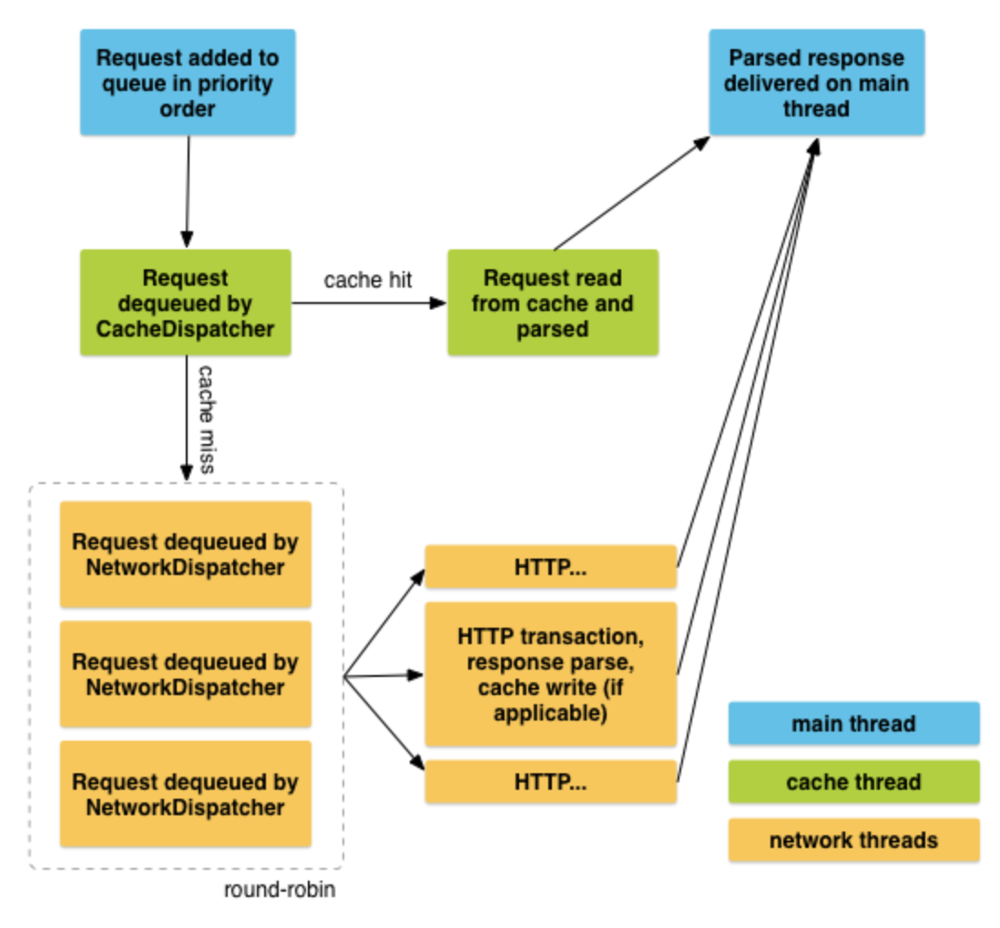

Volley
===
* [Goolge Volley Document](https://ju-hy.tistory.com/66)
* [Google Volley Github](https://github.com/google/volley)
* Android 앱의 네트워킹을 더 쉽고, 무엇보다도 더 빠르게 하는 HTTP 라이브러리
* 기존 HttpURLConnection 작성할때의 단점
  * 직접 쓰레드를 구현해야함
  * 코드가 많아짐
  * 여간 귀찮은 작업이 아닐수 없다.
  * 스레디, 동기화, 병렬 처리등 많으 시간으 투자해야한다. -> 이런것을 쉽게 처리할수 있는 인터페이스를 제공해준다.
* 장점
  1. 네트워크 요청의 자동 예약.
  2. 여러 개의 동시 네트워크 연결
  3. 표준 HTTP 캐시 일관성을 갖춘 투명한 디스크 및 메모리 응답 캐싱
  4. 요청 우선순위 지정 지원
  5. 취소 요청 API. 단일 요청을 취소하거나 취소할 요청의 블록 또는 범위를 설정할 수 있습니다.
  6. 용이한 맞춤설정(예: 재시도, 백오프)
  7. 강력한 정렬 기능을 이용하여 네트워크에서 비동기식으로 가져온 데이터로 UI를 올바로 채우는 작업을 쉽게 실행할 수 있음.
  8. 디버깅 및 추적 도구.
* 단점
  * 모든 응답을 메모리에 유지하므로 대규모 다운로드 또는 스트리밍 작업에는 적합하지 않다.
    * [DownloadManager](https://developer.android.com/reference/android/app/DownloadManager?hl=ko)를 사용해야한다.
* 적용
  * ```gradle
    dependencies {
        ...
        implementation 'com.android.volley:volley:1.1.1'
    }
  * 당연하겠지만 인터넷 작업이니 android.permission.INTERNET 있어야된다.
* 원리
  * Request객체를 RequestQueue(요청큐)에 담으면 알아서 쓰레드로 서버랑 통신하고 그 결과를 반환해준다.
  * 결과값 반환은 Request에 등록된 Listener로 온다.
  * 
* 요청
  ```java
  // https://developer.android.com/training/volley/simple?hl=ko#java 문서상에 있는 코드입니다.
  final TextView textView = (TextView) findViewById(R.id.text);
  // ...

  // Instantiate the RequestQueue.
  RequestQueue queue = Volley.newRequestQueue(this);
  String url ="http://www.google.com";

  // Request a string response from the provided URL.
  StringRequest stringRequest = new StringRequest(Request.Method.GET, url,
              new Response.Listener<String>() {
      @Override
      public void onResponse(String response) {
          // Display the first 500 characters of the response string.
          textView.setText("Response is: "+ response.substring(0,500));
      }
  }, new Response.ErrorListener() {
      @Override
      public void onErrorResponse(VolleyError error) {
          textView.setText("That didn't work!");
      }
  });

  // Add the request to the RequestQueue.
  queue.add(stringRequest);
* 취소
  ```java
  // https://developer.android.com/training/volley/simple?hl=ko#java 문서상에 있는 코드입니다.
  
  // 태그 설정
  public static final String TAG = "MyTag";
  StringRequest stringRequest; // Assume this exists.
  RequestQueue requestQueue;  // Assume this exists.

  // Set the tag on the request.
  stringRequest.setTag(TAG);

  // Add the request to the RequestQueue.
  requestQueue.add(stringRequest);
    
  // 해당 태그는 취소
  // 여기서 cancelall 로 call 하면 Volley에서 요청 핸들러가 호출되지 않도록 보장한다.
  // 이미 진행되고 있는건에서는 취소 불가능한지 확인 필요(아마도 불가능할듯으로 싶음)
  @Override
  protected void onStop () {
      super.onStop();
      if (requestQueue != null) {
          requestQueue.cancelAll(TAG);
      }
  }
    
추가(2021.02.09)(RxJava 프로그래밍, 리엑티브 프로그래밍 기초부터 안드로이드까지 한 번에)
===
* Volley 사용법
 * ReqeustQueue 생성
 * RequestObject 생성
 * Request Object 를 ReqeustQueue에 추가
 * 설정한 Callback으로 응답 수신
* RequestQueue
  * ```java
    public class LocalVolley {
        private static RequestQueue sRequestQueue;
        private LocalVolley() { }
        
        public static void init(Context context) {
            sRequestQueue = Volley.newRequestQueue(context);
        }
        
        public static RequestQueue getRequestQueue() {
            if (sRequestQueue != null) {
                return sRequestQueue;
            } else {
                throw new IllegalStateException("Not inited");
            }
        }
    }
    
    ...
    ..
    .
    
    
    // LocalVolley 초기화
    public class RxAndroid extends Application {
        @Override
        public void onCreate() {
            super.onCreate();
            
            LocalVolley.init(getApplicationContext());
        }
    }
* RequestObject 생성
  * ```java
    // 2. RequestObject 생성, ReqeustQueue에 추가, 콜백 등록
    private ReuqestFuture<JSONObject> getFuture() {
        RequestFuture<JSONObject> future = RequestFuture.newFuture();
        JsonObjectRequest req = new JsonObjectRequest(URL, null, future, future);
        LocalVolley.getRequestQueue().add(req);
        return future;
    }
 
    private JSONObject getData() throws ExecutionException, InterruptedException {
        return getFuture().get();
    }
  * new JsonObjectRequest(URL, null, future, future) 에서 RequestFuture 객체를 콜백으로 설정하였기 때문에 에러와 결과 모두를 RequestFuture 객체로 받을수 있다.
  * Future<T> <-- 지연 완료(Pending completion) 객체
    * 자바에서 사용하는 비동기 계산 결과를 얻는 객체
    * 자바8 이후에는 Observable과 비슷한CompletableFuture<T> 도 제공한다.
 
* 시간정보 얻기
  * ```java
    private Observable<JSONObject> getObservable() {
        return Observable.defer(() -> {
            try {
                return Observable.just(getData());
            } catch (InterruptedExcpetion e) {
                log("error : " + e.getMessage());
                return Observable.error(e);
            } catch (ExecutionException e) {
                log("error : " + e.getCause());
                return Observable.error(e.getCause());
            }
        });
    }
  * defer()
    * 비동기 함수
    * supplier(() -> T) 를 매개변수로 사용하고 T의 데이터 타입은 Callable<? extends OBservableSource<? extends T>>
    
 
    
   
            
 

  
