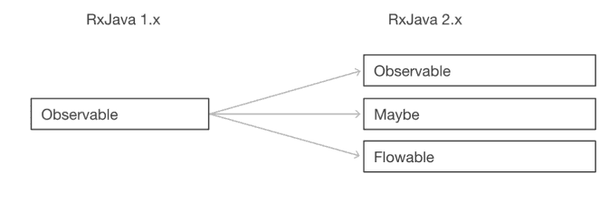

Observable
===
* **Observable은 현재는 관찰되지 않았 지만 이론을 통해서 앞으로 관찰할 가능성을 의미하며 RxJava에서 가장 중요한것이다.**
* Observable은 데이터 흐름에 맞게 알림을 보내 구독자가 데이터를 처리할 수 있도록 해준다.
* 라이프사이클이 없다.
* **상태 변화가 있을 때마다 메서드를 호출**하여 객체가직접 목록의 각 **옵서버에게 변화를 알려줌**
* Rxjava 2.x 부터 세개의 클래스로 세분화되었다.
  * Observable
  * Maybe
  * Flowable
* 
* 세가지 알리미
  * onNext
    * 데이터 발행을 알림
  * onComplete
    * 모든 데이터 발행 완료
  * onError
    * Error 발생 Observable 종료
    
* |Factory Fuction|Function|
  |---------------|--------|
  |Base In RxJava 1.x|create(), from(), just()|
  |Added In RxJava 2.x|fromArray(), fromIterable(), fromCallable(), fromFucture(), fromPublisher()|
  |etc..|Interval(), range(), timer(), defer() ..|
  
  
* just()
  * 예제
    ```java
    public class firstexample { 
      public void emit() { 
        observable.just(1, 2, 3, 4, 5, 6) 
        .subscribe(system.out::println);
        } 
       ...
     } 
     // 출력
     // 1
     // 2
     // 3
     // 4
     // 5
     // 6
  * MarbleDiagram
    * ;
    
subscribe()
---
  * 동작시키기 원하는것을 사전에 정의해둔 다음 실제 그것이 **실행되는 시점을 조절가능**
  * subscribe() 함수를호출해야 실제로 데이터를 발행한다.
  * ```java
    Disposable subscribe() 
    // onError가 발생했을때만 OnErrorNotImplementedException을 throw함
    Disposable subscribe(Consumer<? super T> onNext)
    // onNext
    Disposable subscribe(Consumer<? super T> onNext, Throwable> onError)
    // onNext, onError
    Disposable subscribe(Consumer<? super T> onNext, Consumer<? super java.lang. Consumer<? super java.lang.Throwable> onError, Action onComplete)
    // onNext, onError, onComplete
    
Disposable Interface
---
* dispose()는
  * Observable에게 더 이상 데이터를 발행하지 않도록 구독을 해지하는 함수
* isDisposed()
  * Observable이 데이터를 발행하지 않는지(구독을 해 지했는지) 확인하는 함수
* Observable 계약(Observable Contract)에 따르면 **Observable이 onComplete 알림을 보냈을 때 자동으로 dispose()를 호출해 Observable과 구독자의 관계를 끊는다.**

create()
---
* create() 함수 는 onNext, onComplete, onError 같은 알림을 개발자가 직접 호출해야 한다.
* 원형
  ```java
  // interface
  Observable<T> create(ObservableOnSubscribe<T> source)
  // ObservableOnSubscribe<T>
  public interface ObservableOnSubscribe<T> { 
    void subscribe(ObservableEmitter<T> e) throws Exception;
  }
* 예제
  ```java
  Observable<Integer> source = Observable.create( 
   (ObservableEmitter<Integer> emitter) -> { 
     emitter.onNext(100); 
     emitter.onNext(200); 
     emitter.onNext(300); 
     emitter.onComplete();
  }); 
  source.subscribe(System.out::println); // 발행을 꼭해줘야한다.!!!
  // 출력
  // 100
  // 200
  // 300
* RxJava의 javadoc에 따르면 create()는 RxJava에 익숙한 사용자만 활용하도록 권고
  * dispose -> calllback 해제(메모리 누수 가능성)
  * 에러발생시 반드시 onError로 처리
  * 반드시 구독중에만 onNext, onComplete 호출
  * 배압 직접처리
  
fromArray()
---
  * fromXXX() 계열 함수는 단일 데이터를 처리하는 just(), create()와 다르게 다중데이터를 처리할때 사용한다.
  * fromArray()는 배열에 들어있는 데이터를 처리할때 활용 사용
  * ```java
    Integer[] arr = {100, 200, 300};
    Observable<Integer> source = Observable.fromArray(arr);
    source.subscribe(System.out::println)
    // result:
    // 100
    // 200
    // 300
    
    // int[] array (X)
    int[] intArray = {400, 500, 600};
    Observable.fromArray(intArray).subscribe(System.out::println);
    // result:
    // I@200a570f
    
    //use toIntegerArray() function when you use int[] array (O)
    int[] intArray = {400, 500, 600};
    Observable<Integer> source = Observable.fromArray(toIntegerArray(intArray));
    source.subscribe(System.out::println);
    // result:
    // 400
    // 500
    // 600
    
fromIterable()
---
* 반복자를 반환할때 사용
* 사용 예
  * ArrayList(List 인터페이스)
  * Array BlockingQueue(BlockingQueue 인터페이스)
  * HashSet(Set 인터페이스)
  * LinkedList
  * Stack
  * TreeSet
  * Vector
* ```java
  // ArrayList
  List<String> names = new ArrayList<>(); 
  names.add("Jerry");
  names.add("William");
  names.add("Bob");
 
  Observable<String> source = Observable.fromIterable(names);
  source.subscribe(System.out::println);
  // result :
  // Jerry
  // William
  // Bob
* ```java
  // BlockingQueue
  BlockingQueue<Order> orderQueue = new ArrayBlockingQueue<>(100);
  orderQueue.add(new Order("ORD-1"));
  orderQueue.add(new Order("ORD-2"));
  orderQueue.add(new Order("ORD-3"));
 
  Observable<Order> source = Observable.fromIterable(orderQueue);
  source.subscribe(order -> System.out.println(order.getId()));
  // result :
  // ORD-1
  // ORD-2
  // ORD-3

fromCallable()
---
* **Java5 기본 제공 비동기**
* 메서드 하나
* 리턴값 존재
* 기존 사용하던 callable을 RxJava의 fromCallable과 연동이 가능하다.
* ```java
  // lambda
  Callable<String> callable = () -> {
    Thread.sleep(1000);
    return "Hello Callable";
  };
 
  // non-lambda
  Callable<String> callable = new Callable<String>() {
      @override
      public String call() throws Exception {
        Thread.sleep(1000);
        return "Hello Callable";
      }
  };
 
  Observable<String> source = Observable.fromCallable(callable);
  source.subscribe(System.out::println);
  // result:
  // Hello Callable

fromFutrue()
---
* **Java5 기본 제공 비동기**
* Future는 비동기 처리 결과를 표현하기 위해서 사용된다. 비동기 처리가 완료되었는지 확인하고, 처리 완료를 기다리고, 처리 결과를 리턴하는 메소드를 제공한다.
* 비동기 계산의 **결과**를 구할 때 사용한다.
* ```java
  Future<String> future = Executors.newSingleThreadExecutor().submit(() ->
    Thread.sleep(1000);
    return "Hello Future";
  });
 
  Observable<String> source = Observable.fromFuture(future);
  source.subscribe(System.out::println);
* Executors 클래스는 newSingleThreadExecutor() 외에 FixedThreadPool, CachedThreadPoll을 지원한다. **하지만** RxJava에서 **제공하는** 스케쥴러를 활용하도록 **권장**
 
fromPublisher()
---
* **Java9 Flow API의 일부**
* Publisher의 패키지명이 org.reactivestreams이다.
* ```java
  import org.reactivestreams.Publisher;
  import org.reactivestreams.Subscriber;
  import io.reactivex.Observable;
  
  //lambda
  Publisher<String> publisher = (Subscriber<? super String> s) -> {
    s.onNext("Hello Observable.fromPublisher()");
    s.onComplete();
  };

  //non-lambda
  Publisher<String? publisher = new Publisher<String>() {
    @override
    public void subscribe(Subscriber<? super String> s) {
        s.onNext("Hello Observable.fromPublisher()");
        s.onComplete();
    }
  };

  Observable<String> source = Observable.fromPublisher(publisher);
  source.subscribe(System.out::println);
  Observable(String> source = Observable.fromPublisher(publisher);
  source.subscribe(System.out::println);
  // result:
  // Hello Observable.fromPublisher()
