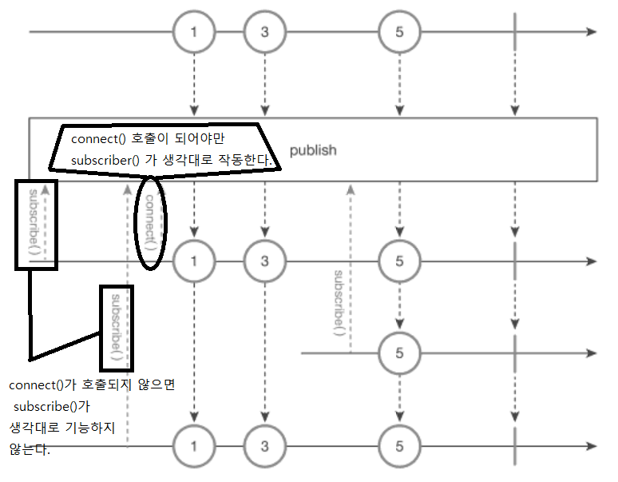

ConnectableObservable
===
* Subject 클래스처럼 **차가운 Observable -> 뜨거운 Observable 로 변환**
* **데이터 하나를 여러 구독자에게 동시에 전달할 때 사용**
* **connect()** 함수를 **호출**한 **시점**부터 **subscriber()** 함수를 호출한 **구독자**에게 **발행**
* ConnectableObservable 객체 **생성**을 위해서는 **publish()** 함수를 호출해야 한다.
  * publish()
    * 데이터 발행을 유예하는 역할
* marblediagram(ConnectableObservable.publish())
  * 
* ConnectableObservable
  * ```java
    String[] dt = {"1", "3", "5"};
    Observable<String> balls = Observable.interval(100L, TimeUnit.MILLISECONDS) // 시간, 시간의단위를 넣어줌(여기서는 100ms간격으로 데이터를 발행한다고 생각하면됨) 뜻함, interval 함수는 테스트코드 작성할때 많이 활용됨
      .map(Long::intValue) // interval이 정수만 발행가능해서 변환함
      .map(i -> dt[i])
      .take(dt.length);
    ConnectableObservalbe<String> source = balls.publish();
    source.subscribe(data -> System.out.println("Subscriber #1 => " + data));
    source.subscribe(data -> System.out.println("Subscriber #2 => " + data));
    source.connect(); // 데이터 발행 시작
 
    CommonUtils.sleep(250); // 세번째 구독자 나오기전 250ms 대기
    source.subscribe(data -> System.out.println("Subscriber #3 => " + data));
    CommonUtils.sleep(100); // 100ms 대기후 구독 종료
    // result:
    // Subscriber #1 => 1 // 발행
    // Subscriber #2 => 1 // 발행
    // Subscriber #1 => 3 // "1" 발행후 100ms 대기후 (interval함수에 따라서) 발행
    // Subscriber #2 => 3 // "1" 발행후 100ms 대기후 (interval함수에 따라서) 발행
    // Subscriber #1 => 5 // "3" 발행후 250ms 대기후 (CommonUtils.sleep 에 따라서) 발행 
    // Subscriber #2 => 5 // "3" 발행후 250ms 대기후 (CommonUtils.sleep 에 따라서) 발행
    // Subscriber #3 => 5 // "3" 발행후 250ms 대기후 (CommonUtils.sleep 에 따라서) 발행
   
