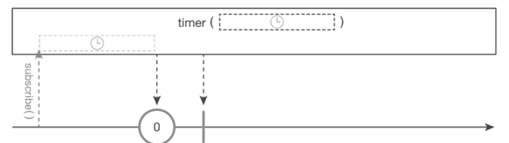

timer() 함수
===
* marblediagram
  
* interval() 함수와 유사하지만 **한 번만 실행하는 함수**
  * 일정 시간이 지난후 ** 한 개의 데이터를 발행하고 onComplete() 이벤트가 발생**
* ```java
  @SchedulerSupport(SchedulerSupport.COMPUTATION) // 계산 스케쥴러에서 실행
  public static Observable<java.lang.Long> timer(
    long delay, java.util.concurrent.TimeUnit unit)
* ```java
  CommonUtils.exampleStart();
  Observable<String> source = Observable.timer(500L, TimeUnit.MILLISECONDS)
    .map(notUsed -> {    // 0L 이라는 값을 발행하지만 실제로 값을 map() 함수에서 활용하는 것이 아니므로 현재 시각을 표시하는 람다 표현식의 인자 이름을 notUsed로 명시
      return new SImpleDateFormat("yyyy/MM/dd HH:mm:ss")
        .format(new Date());
    });
  source.subscribe(Log::it);
  CommonUtils.sleep(1000);
  
  // result:
  // RxComputationThreadPool -1 | 739 | value = 2017/02/12 21:15:54
  
