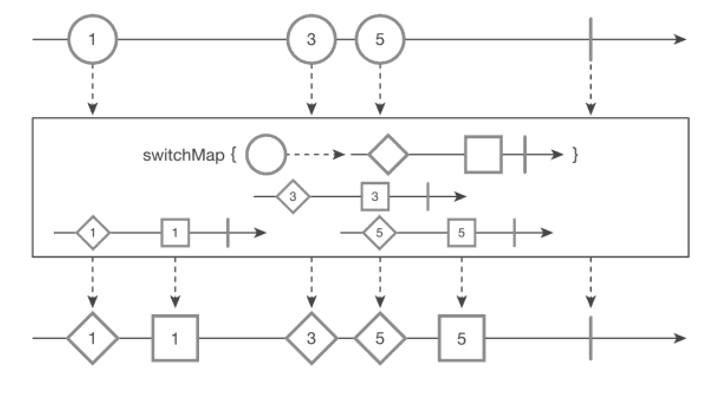

switchMap() 함수
===
* concatMap는 기존 순서대로 전부 작업하면서 시간이 더 오래걸린다. 하지만 switchMap은 순서도 보장해주지만 **기존에 진행 중(발행 중)이던 작업을 바로 중단까지 하는 함수**
* **마지막에 들어온 값만 처리하고 싶을 때 사용**
* marblediagram
  
* 3을 처리하는중 5가 들어와서 3은 더 이상 진행이 되지 않았다.
* ```java
  // CommonUtils.exampleStart();
 
  String[] balls = {"1", "3", "5"};
  Observable<String> source = Observable.interval(100L, TimeUnit.MILLISECONDS)
    .map(Long::intValue)
    .map(idx -> balls[idx]
    .take(balls.length)
    .switchMap(ball -> Observable.interval(200L, TimeUnit.MILLISECONDS)
      .map(notUsed -> ball + "◇")
      .take(2)
    );
  source.subscribe(Log::it);
  CommonUtils.sleep(2000);
  
  // result:
  // RxComputationThreadPool-4 | 685 | value = 5◇
  // RxComputationThreadPool-4 | 884 | value = 5◇


> doOnNext()를 넣어 중가 결고 알아복
* doOnNext()는 중간결과를 확인할수 있는 함수이다.
* ```java
  CommonUtils.exampleStart();
  
  String[] balls = {"1", "3", "5"};
  Observable<String> source = Observable.interval(100L, TimeUnit.MILLISECONDS)
    .map(Long::intValue)
    .map(idx -> balls[idx])
    .take(balls.length)
    .doOnNext(Log::it) // 중간 결과 확인요 함수
    .switchMap(
      ball -> Observable.interval(200L, TimeUnit.MILIISECONDS)
        .map(notUsed -> ball + "◇")
        .take(2)
    );
  source.subscribe(Log::it)l
  CommonUtils.sleep(2000);
  
  // result:
  // 2020-11-25 20:37:56.325 19513-19548/com.study.rxandroid I/System.out: RxComputationThreadPool-1 | 219 | value = 1
  // 2020-11-25 20:37:56.424 19513-19548/com.study.rxandroid I/System.out: RxComputationThreadPool-1 | 319 | value = 3
  // 2020-11-25 20:37:56.524 19513-19548/com.study.rxandroid I/System.out: RxComputationThreadPool-1 | 419 | value = 5
  // 2020-11-25 20:37:56.726 19513-19551/com.study.rxandroid I/System.out: RxComputationThreadPool-4 | 621 | value = 5◇
  // 2020-11-25 20:37:56.926 19513-19551/com.study.rxandroid I/System.out: RxComputationThreadPool-4 | 820 | value = 5◇ 
 
