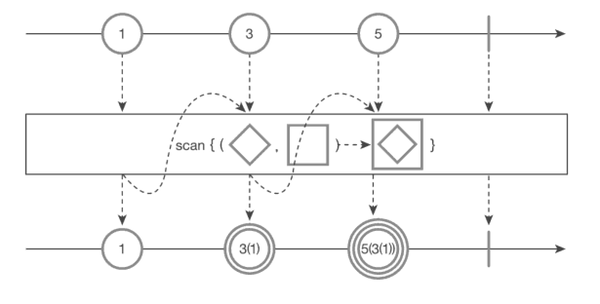

scan() 함수
===
* marblediagram
  
* 실행할 때마다 입력값에 맞느 중간 결과 및 최종 결과를 구독자에게 발행한다.
  * reduce()함수와으 차이점!!
    * reduece() 함수 모든 데이터 입력된 후 그것을 종합하여 마지막 1개의 데이터만의 구독자에 발행하는것과 **중간결과를 계속 발행하는것의 차이**
* ```java
  String[] balls = {"1", "3", "5"};
  Observable<String> source = Observable.fromArray(balls)
    .scan( (ball1, ball2) -> ball2 + "(" + ball1 + ")");
  source.subscribe(Log::i);
  
  // result:
  // main | value = 1
  // main | value = 3(1)
  // main | value = 5(3(3))
* reduce는 onComplete나 마지막 입력값을 입력되지 않을 경우 발행을 하지 않을숟 있ㄱ 때문에 Maybe 클래스 타입을 정의했다.
* **scan는 값이 입력될 때마다 발행이 되니 Observable을 사용한다.**
