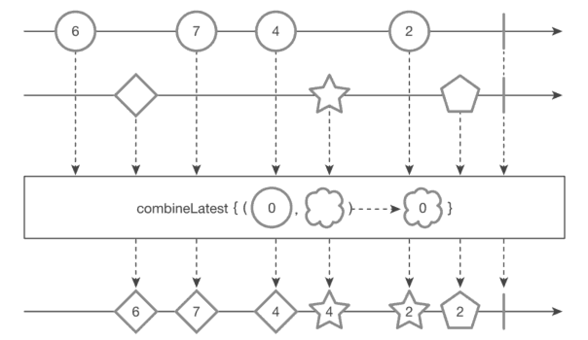

combineLatest() 함수
---
* 2개 이상의 Observable을 기반으로 Observable 각각의 값이 변경되었을 때 갱신해주는 함수
* marblediagram
  
* 첫 번째 Observable과 두 번째 Observable을 결합하는 기능을 만든다고 하면 **첫 번째 Observable의 값 혹은 두 번째 Observable의 값이 변경되었을때 그 값을 자동으로 갱신**해준다.
* **두 Observable 모두 값을 발행하면 그때는 결과값이 나온다.**
* ```jaca
  @SchedulerSupport(SchedulerSupport.NONE)
  public static <T1, T2, R> Observable<R> combineLatest(
    ObservableSource<? extends T1> source1,
    ObservableSource<? extends T2> source2,
    BiFunction<? super T1, ? super T2, ? extends R> combiner)
* **어느 하나라도 값이 변경이 된다면 바로 결과가 발행이 된다는것이 특징이다.**
* ```java
  String[] data1 = {"6", "7", "4", "2"};
  String[] data2 = {"DIAMOND", "STAR", "PENTAGON"};

  Observable<String> source = Observable.combineLatest(
    Observable.fromArray(data1)
      .zipWith(Observable.interval(100L, TimeUnit.MILLISECONDS),
        (shape, notUsed) -> Shape.getColor(shape)),
    Observable.fromArray(data2)
      .zipWith(Observable.interval(150L, 200L, TimeUnit.MILLISECONDS),
        (shape, notUsed) -> Shape.getSuffix(shape)), (v1, v2) -> v1 + v2);
  
  source.subscribe(Log::i);
  CommonUtils.sleep(1000);
  
  // result:
  // 2020-12-05 12:29:20.145 26733-26808/com.study.rxandroid I/System.out: RxComputationThreadPool-2 | value = 6◇
  // 2020-12-05 12:29:20.193 26733-26807/com.study.rxandroid I/System.out: RxComputationThreadPool-1 | value = 7◇
  // 2020-12-05 12:29:20.292 26733-26807/com.study.rxandroid I/System.out: RxComputationThreadPool-1 | value = 4◇
  // 2020-12-05 12:29:20.343 26733-26808/com.study.rxandroid I/System.out: RxComputationThreadPool-2 | value = 4-S
  // 2020-12-05 12:29:20.393 26733-26807/com.study.rxandroid I/System.out: RxComputationThreadPool-1 | value = 2-S
  // 2020-12-05 12:29:20.544 26733-26808/com.study.rxandroid I/System.out: RxComputationThreadPool-2 | value = 2-P
