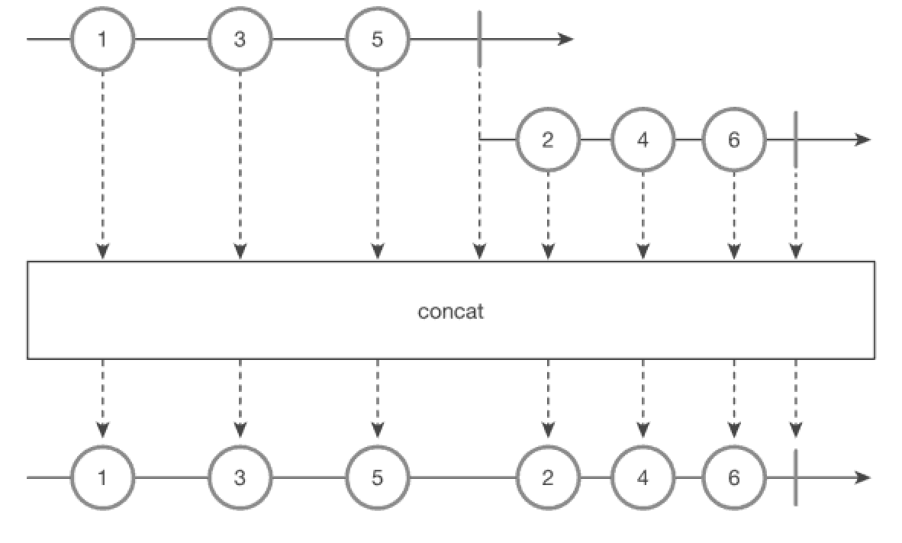

concat() 함수
===
* Observable을 이어 붙여주는 함수이다.
* 예를들어, 첫 번째 Observable에서 onComplete 이벤트가 발생해야 두 번째 Observable을 구독하는 방식이다.
* 결합은 최대 4개까지 가능하다.
* 
* ```java
  @SchedulerSupport(SchedulerSupport.NONE)
  public static <T> Observable<T> concat(
    ObservableSource<? extends T> source1,
    ObservableSource<? extends T> source2
  )
* ```java
  // Action 클래스 (io.reactive.functions)
  Action onCompleteAction = () -> Log.d("onComplete()");

  String[] data1 = {"1", "3", "5"};
  String[] data2 = {"2", "4", "6"};
  Observable<String> source1 = Observable.fromArray(data1)
    .doOnComplete(onCompleteAction);
  Observable<String> source2 = Observable.interval(100L, TimeUnit.MILLISECONDS)
    .map(Long::intValue)
    .map(idx -> data2[idx])
    .take(data2.length)
    .doOnComplete(onCompleteAction);
  
  // source1 과 source2 를 concat 으로 합친 source 를 만들었다.
  Observable<String> source = Observable.concat(source1, source2)
    .doOnComplete(onCompleteAction);
  
  source.subscribe(Log::i);
  CommonUtils.sleep(1000);
  
  // result:
  // 2020-12-08 23:29:50.525 29846-29846/com.study.rxandroid I/System.out: main | value = 1
  // 2020-12-08 23:29:50.525 29846-29846/com.study.rxandroid I/System.out: main | value = 3
  // 2020-12-08 23:29:50.528 29846-29846/com.study.rxandroid I/System.out: main | value = 5
  // 2020-12-08 23:29:50.528 29846-29846/com.study.rxandroid I/System.out: main | debug = onComplete()
  // 2020-12-08 23:29:50.670 29846-30003/com.study.rxandroid I/System.out: RxComputationThreadPool-1 | value = 2
  // 2020-12-08 23:29:50.771 29846-30003/com.study.rxandroid I/System.out: RxComputationThreadPool-1 | value = 4
  // 2020-12-08 23:29:50.871 29846-30003/com.study.rxandroid I/System.out: RxComputationThreadPool-1 | value = 6
  // 2020-12-08 23:29:50.871 29846-30003/com.study.rxandroid I/System.out: RxComputationThreadPool-1 | debug = onComplete()
  // 2020-12-08 23:29:50.872 29846-30003/com.study.rxandroid I/System.out: RxComputationThreadPool-1 | debug = onComplete()
  
* Action객체는 인자가 없는 람다 표현식을 넣어야할때 사용
