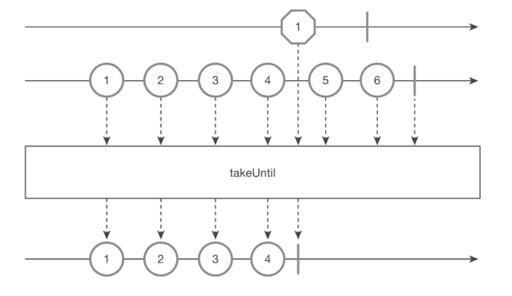

takeUntil() 함수
===
* 인자로 받은 Observable에서 어떤 값을 발행하면 현재 Observable의 데이터 발행을 중단하고 즉시완료(onComplete) 합니다.
  * take() 처럼 일정 개수만 발행하고 완료되는 것을 그냥 기준을 다르 Observable이 값을 발행했는지로 판단하는것
* marblediagram
  * 
* ```java
  @SchedulerSupport(SchedulerSupport.NONE)
  public final <U> Observable<T> takeUntil(ObservableSource<U> other)
* ```java
  String[] data = {"1", "2", "3", "4", "5", "6"};

  Observable<String> source = Observable.fromArray(data)
    .zipWith(Observable.interval(100L, TimeUnit.MILLISECONDS), (val, notUsed) -> val)
    .takeUntil(Observable.timer(500L, TimeUnit.MILLISECONDS));

  source.subscribe(Log::i);
  CommonUtils.sleep(1000);

  // result:
  // 2020-12-12 12:08:32.614 21528-29254/com.study.rxandroid I/System.out: RxComputationThreadPool-2 | value = 1
  // 2020-12-12 12:08:32.713 21528-29254/com.study.rxandroid I/System.out: RxComputationThreadPool-2 | value = 2
  // 2020-12-12 12:08:32.813 21528-29254/com.study.rxandroid I/System.out: RxComputationThreadPool-2 | value = 3
  // 2020-12-12 12:08:32.913 21528-29254/com.study.rxandroid I/System.out: RxComputationThreadPool-2 | value = 4
* takeUntil의 Observable이 발행하는 순간까지만 값을 발행한다.
