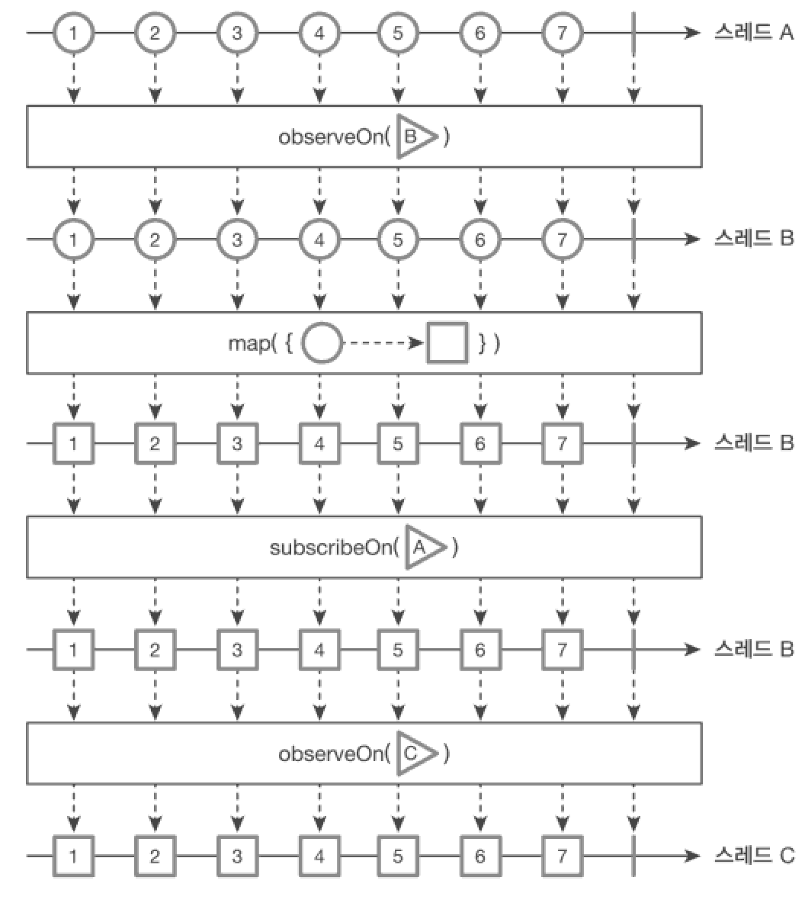

ObserveOn() 활용
===
* subscribeOn -> 데이터 흐름을 발행하는 스레드를 지정
  * 한번 호출했을 때 결정한 스레드를 고정하며 이후에는 다시 호출해도 스레드가 바뀌지 않는다.
* observeOn -> 결과를 구독자에게 전달하는 스레드를 지정
  * 여러 번 호출 가능하며 호출되면 그 다음부터 동작하는 스레드를 바꿀 수 있다.
* 

> OpenWeatherMap 연도
* 
