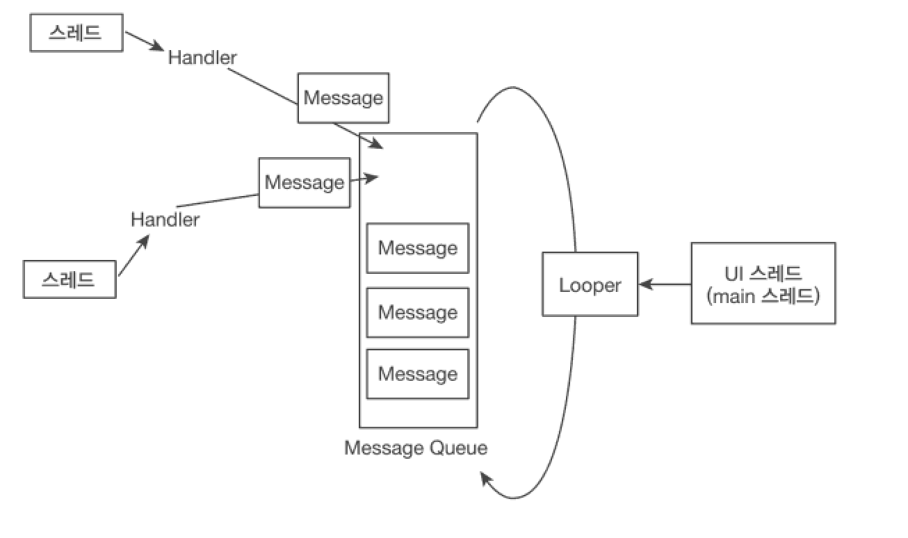
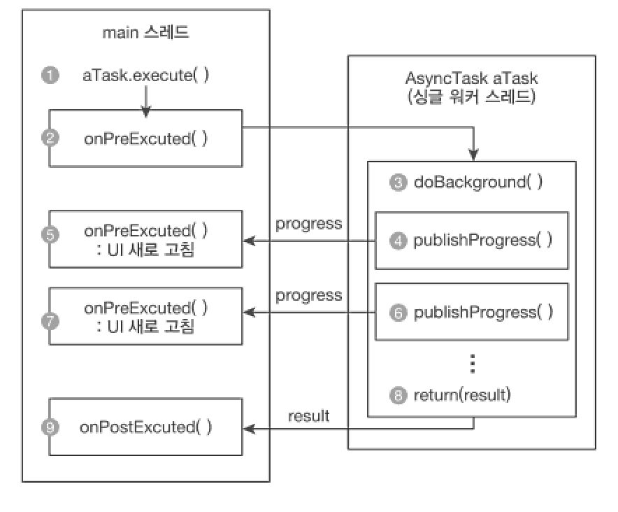

스레드를 대체하는 RxAndroid
===
* 안드로이드는 싱글 스레드 모델이고 UI 업데이트는 UI 스레드에서만 업데이트 가능
* 안드로이드에서 앱의 스레드 설계를 잘못할경우 앱이 멈추거나 속도가 저하되는 현상이 발생되기때문에 고려해서 만들어야 한다.
* 안드로에서는 Looper와 Handler로 뷰를 업데이트 할수 있게끔 제공
* 
* **Handler가 Thread를 생성하고 메시지 객체 넣어져서 메시지 큐에 들어가며 메시지큐에 메시지들은 루퍼가 순서대로 처리한다.**
* 안드로이드 제공해주는 HandlerThread 또는 RxAndroid 에서 제공해주는 AsyncTask(@Deprecated [사망이유](https://medium.com/@prixe87/asynctask-deprecated-대비하기-392f3be5a712)) 클래스도 제공해준다.
* ```java
  private void initAndroidAsync() {
      myAsyncTask = new MyAsyncTask();
      myAsyncTask.execute("Hello", "async", "world");
  }
  
  public class MyAsyncTask extends AsyncTask<String, Void, Stringg> {
      @Override
      protected String dolnBackGround(String... params) {
          StringBuilder word = new StringBulider();
          for(String s : params) {
              word.append(s).append(" ");
          }
          return word.toString();
     }
     
     @Override
     protected void onPostExecute(String result) {
        super.onPostExecute(result);
        mAndroidTextView.setText(result);
     }
  }
* 장점
  * AsyncTask 클래스는 UI 스레드가 아닌 싱글 워커 스레드에서 동작하며 publishProgress()를 이용하여 **실행 중간중간 화면을 바로 갱신한다.**
  * AstncTask 는 앞서 설명된 Handler, Looper의 개념을 몰라도 UI 스레드에 업데이트 할수 있는 **아주 편리한 기능**
* 단점
  * 재사용 불가능(한 번만 사용가능)
  * **엑티비티 종료를 명시안할경우 메모리 누수 가능성 <-- 이것때문에 이제는 deprecated 되어버렸고 구글에서는 사용을 지양하길 권한다**
  * 항상 UI 스레드 위에서 불러와야 한다.
* Process
  

> RxAndroid에서의 구현
* ```java
  private void initRxAsync() {
      Observable.just("Hello", "rx", "world");
        .reduce((x,y) -> x + " " + y)
        .observeOn(AndroidSchedulers.mainThread())
        //  .subscribe(getObserver());
        .subscribe(
          mRxTextView::setText,
          e -> Log.e(TAG, e.getMessage()),
          () -> Log.i(TAG, "done")
        );
  }
  
  private MaybeObserver<String> getObserver() {
      return new MaybeObserver<String>() {
          @Override
          public void onSubscribe(Disposable d) { }
        
          @Override
          public void onSuccess(String result) {
              mRxTextView.setText(result);
          }
          
          @Override
          public void onError(Throwable e) {
              Log.e(TAG, e.getMessage());
          }
          
          @Override
          public void onComplete() {
              Log.i(TAG, "done");
          }
     };
 }
