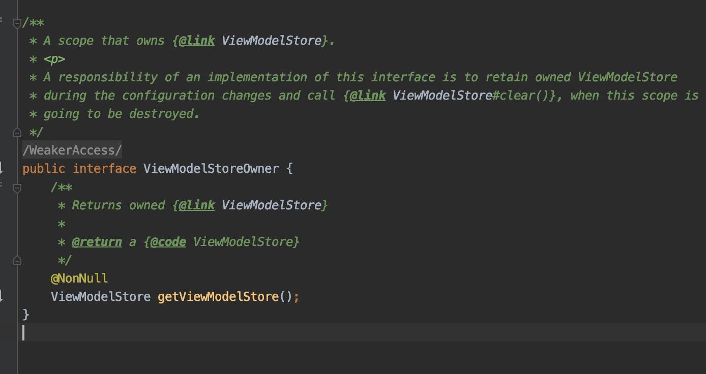
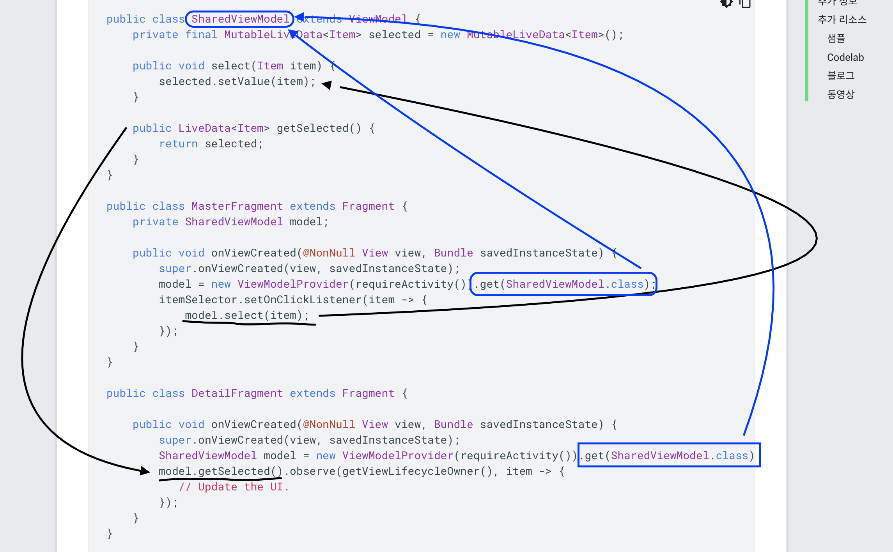

[View Model(뷰 모델)](https://developer.android.com/topic/libraries/architecture/viewmodel?hl=ko#java)
===
* MVVM의 ViewModel 과의 관계 - [출처](https://wooooooak.github.io/android/2019/05/07/aac_viewmodel/)
  * MVVM 의 viewmodel은 view와 1:n 의 관계를 가지지만 AAC-viewmodel은 activity 하나당 1개를 가지기 때문에 1:1의 관계이다.
  * 액티비티 한 개 내에서만 유효한 싱글톤이다.
  * MVVM 패턴의 ViewModel 을 사용해서 구현할수도 있지마 생명주기에 영향을 받기 때문에 ui가 시스템에 영향을 받아 재 생성되거나 제거될경우 데이터를 보관하는것에서 굉장히 복잡해진다.
* HolderFragment 라고 명명된 fragment 를 생성해서 엑티비티에 추가하고 HolderFragment가 viewmodel 맴버 변수들을 관리하는데 setRetainInstance(true) 를 사용해서 메모리에 프레그먼트를 남기는 기법을 사용하는 기법으로 만들어졌으니까 사실은 fragment이다.
  * 그러므로 ViewModelProvider를 사용해서 객체를 만들어야만 HolderFragment에 의해 관리된다.
* ViewModel의 목적은 UI 컨트롤러의 데이터를 캡슐화하여 구성이 변경되어도 데이터를 유지하는것
* Android Architecture ViewModel의 약자인 AAC ViewModel이라고 부르기도 한다.
* ViewModel은 ViewModelStore에서 내부적으로 HashMap<String, ViewModel> mMap = new HashMap<>() 으로 ViewModel들을 관리한다.
  * ViewModelStore는 다음과 같이 생겼다
  
  * 이를 ViewModelOwner 가 관리한다 코드는 다음과 같다.
    * 
  * 이를 Fragment와 ComponentAcitivty에서 implementr 한다.
    * 
    * 
* ```java 
  public class MyViewModel extends ViewModel {
    private MutableLiveData<List<User>> users;
    public LiveData<List<User>> getUsers() {
        if (users == null) {
            users = new MutableLiveData<List<User>>();
            loadUsers();
        }
        return users;
    }

    private void loadUsers() {
        // Do an asynchronous operation to fetch users.
    }
  }

  ...
  ..
  public class MyActivity extends AppCompatActivity {
    public void onCreate(Bundle savedInstanceState) {
        // Create a ViewModel the first time the system calls an activity's onCreate() method.
        // Re-created activities receive the same MyViewModel instance created by the first activity.

        MyViewModel model = new ViewModelProvider(this).get(MyViewModel.class);
        model.getUsers().observe(this, users -> {
            // update UI
        });
    }
  }
* 특징
  * ViewModel 객체는 뷰 또는 **LifecycleOwners의 특정 인스턴스화보다 오래 지속**되도록 설계
  * ViewModel을 다루는 테스트를 더 쉽게 작성 가능
  * 수명 주기를 인식하는 Observable의 변경사항을 관찰해서는 안됨
  * Application Context가 필요할경우 AndroidViewModel 클래스를 확장하고 생성자에 Application을 받는 생성자를 포함
    * 구글측에서는 컨텍스트 최대한 사용하지 말라고 권함 왜냐하면 컨텍스트는 날라가기 떄문에

> viewmodel 수명주기
* lifecycle
  * 
* 활동에서는 활동이 끝날 때까지 그리고 프래그먼트에서는 프래그먼트가 분리될 때까지 메모리에 남아 있다.
  * ViewModel이 처음 요청되었을 때부터 활동이 끝나고 폐기될 때까지 ViewModel은 존재

> viewmodel을 통한 fragment간 데이터 공유
* ```java
  public class SharedViewModel extends ViewModel {
     private final MutableLiveData<Item> selected = new MutableLiveData<Item>();

     public void select(Item item) { 
         selected.setValue(item);
     }

     public LiveData<Item> getSelected() {
         return selected;
     }
  } 

  public class MasterFragment extends Fragment { 

     public void onViewCreated(@NonNull View view, Bundle savedInstanceState) {
         super.onViewCreated(view, savedInstanceState);
         SharedViewModel model = new ViewModelProvider(requireActivity()).get(SharedViewModel.class);
         itemSelector.setOnClickListener(item -> {
             model.select(item);
         });
     }
  }

  public class DetailFragment extends Fragment {

     public void onViewCreated(@NonNull View view, Bundle savedInstanceState) {
         super.onViewCreated(view, savedInstanceState);
         SharedViewModel model = new ViewModelProvider(requireActivity()).get(SharedViewModel.class);
         model.getSelected().observe(getViewLifecycleOwner(), item -> {
            // Update the UI.
         });
     }
  }
* 

> ViewModel로 로더 전체과정
* room과 livedata를 사용
  * 데이터베이스가 변경되면 Room에서 LiveData에 변경을 알리고, 알림을 받은 LiveData는 수정된 데이터로 UI를 업데이트
* 

* 데이터가 더 복잡해지면 데이터 로드만을 위한 별도의 클래스를 사용
  * 구성 변경 시 데이터를 로드, 유지 및 관리하는 방법에 관한 자세한 내용은 UI 상태 저장을 참고하세요.
  * Android 앱 아키텍처 가이드에서는 이러한 함수를 처리하는 저장소 클래스 빌드를 제안
