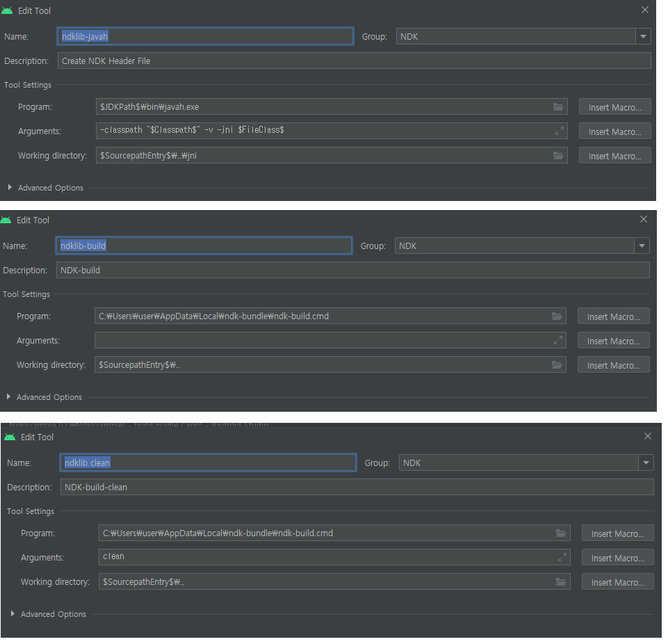

+ android.mk 파일은 프로젝트의 jni/ 디렉토리에 속해있다.
	+ build 시스템에서 한번이상 파싱하는 **gnuMakeFileFragment**  
	+ 정의되지 않은 상태로 남겨두는 **프로젝트** **전반의 설정**을 정의하는 데 유용하다.
	+ 특정 **모듈**의 프로젝트 전체 **설정**을 재정의 가능
	+ 기능
		+ 소스를 module로 그룹화 
		+ 여러 모듈에 같은 소스 파일을 사용 가능
		+ 헤더 파일 표시

+ JNI
	+ **J**ava **N**ative **I**nterface
	+ JVM위에서 실행되고 있는 Java 코드가 다음과 같은 라이브러리를 호출하거나 반대로 호출되는것을 가능하게 하는 프로그래밍 프레임워크
		+ Native Application Program
		+ c
		+ c++
		+ assembly
		+ 기타 다른 언어

+ .so ( [출처](pangate.com/m/890) )
	+ c language -> compile -> .o(object) 의 형태로
	+ java language -> compile -> .class 처럼 Java도 c가 태생이기 때문에 따라가기 때문에 비슷한 형태로 진행된다.
	+ 위와 같은것 처럼
	+ .a(Archive)
		+ 정적 라이브러리(최종파일안에 묻어짐)
		+ ar이란 명령어로 생성을 한다.
	+ .so(Shared Object), .sl
		+ 동적 라이브러리(프로그램 실행후 필요할때 불려짐)
		+ cc명령으로 컴파일하면서 만들게 된다.
		+ 프로그램 실행중 교체도 가능하다.*
	+ 여하튼 프로그램이 **실행**되는 시점에는 정해진 Directory에 이 **Library 파일들이 반드시 존재**해야한다.
	+ 대게 LD_LIBRARY_PATH를 Directory로 정한다.
	+ 솔루션 업체들은 *.a , *.so 를 함께 제공해준다. (어떤 프로그램을 만들지 알 수 없기 때문)
	+ 하지만 **프로그램이 재실행되어야 한다는 단점**
		+ 이를 개선한것이 동적적재라이브러리이며 dlopen()을 응용하여 상품화시킨 것이 TmaxSoft의 dlcall이다.
    
+ NDK ( [출처](https://duzi077.tistory.com/134) )
  + Native Development Kit
  + 속도빠른 c, c++을 어쩔수없이 사용해야하는 경우가 있다.
  + 이러한 경우에 사용할수 있는것이 NDK 이다.
  + NDK란 네이티브 코드 언어를 사용할 수 있게 해주는 toolset이다.
  + Cmake
      + Gradle과 함께 작동한다.
      + 네이티브 라이브러리를 빌드하는 외부 빌드 도구이다. 
      + **ndk-build만 사용하려는 경우 필요하지 않다**   
  + LLDB
    + Debugger for Native Code In LLDB Android Studio
  + javah
    + Native Method를 C header file과 C SourceFile 로 구현해주는 기능을 제공
  
+ 자세한 설치, 사용
	+ https://re-build.tistory.com/7
	+ https://gamdekong.tistory.com/102
	+ https://duzi077.tistory.com/134
	+ https://question0.tistory.com/39
	
+ c(source) , h(header) file로 .so 파일 만들기
	+ https://question0.tistory.com/39
	+ 위에 있는 블로그대로 따라하되 다음 순서대로 한다.
	+ 파일설정은 다음처럼 한다.
	+ 
	+ 무언가 안된다면 build - Rebuild Project를 실행한다.
	+ 큰 흐름은 다음과 같다.
		+ MainActivity 에서 LoadLibrary 를 하고 javah를 하면은 HeaderFile이 생성된다.
		+ MainActivity 에서 Native를 사용한다면 javah를 사용하여서 다시 HeaderFile을 만들어야한다.
		+ javah를 사용하여도 HedaerFile이 변경이 되지 않는다면 build - Rebuild Project를 수행하고 다시 하여야한다.
		+ MainActivity 에서 사용하려는 함수는 헤더파일에 명시되어야 하며 헤더파일에 명시된 함수는 .cpp 에 존재하여야한다.
		+ .cpp 에 함수명은 다음형식으로 되어있다.
			+ Java_패키지명1_패키지명2_class명_메소드명 ( ex :  Java_com_example_ndkexample_MainActivity_helloNDK )
		+ android.mk , application.mk 를 생성한다. ( .cpp 파일이름 변경 )
		+ .cpp 파일을 만든다.
		+ MainActivity 에서 우클릭 Link c++ 클릭
			+ 1. ndklib-build 선택 
			+ 2. andorid.mk 파일 선택(위에서 생성한)
		+ MainActivity 에서 우클릭 NDK -> ndklib-build 하면 .so가 생성된다.
