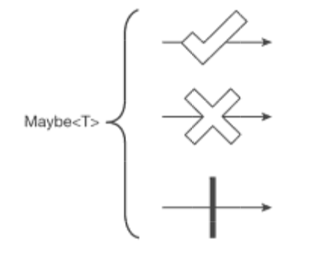

Maybe 클래스
===
* Observable의 특수 형태( >= Rxjava2)
* Single 클래스 + onComplete이벤트 의 형태이다
* **데이터를 발행하지 않고도 완료할수 있다.**
* marblediagram ( v -> onSuccss, x -> onError, | -> onComplete)
  
* **보통 Observable의 특정 연산자를 통해 생성**
  * Maybe 객체 생성 가능 Reactive 연산자
    * elementAt()
    * firstElement()
    * flatMapMayble()
    * lastElement()
    * reduce()
    * singleElement()
    * ...
