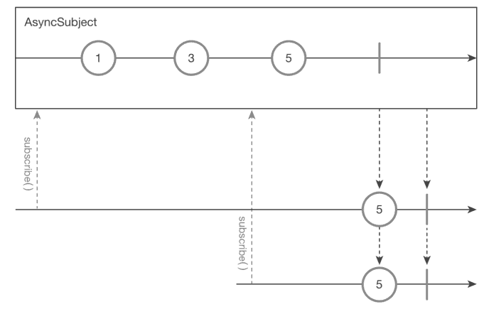
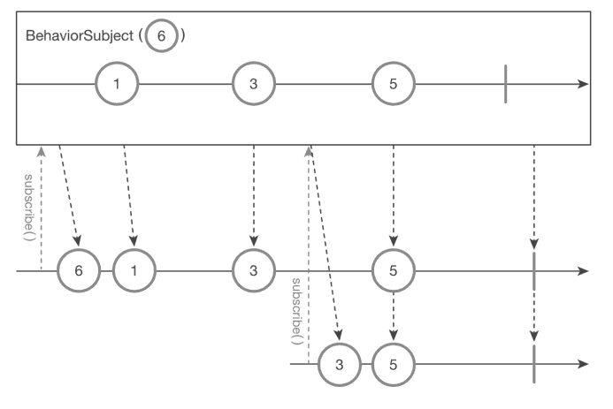
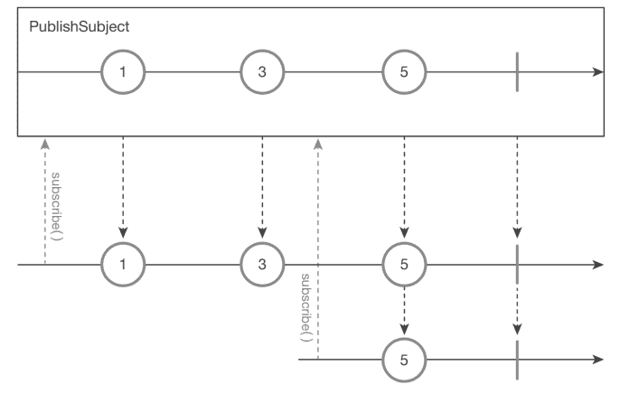

Subject 클래스
===
* 차가운(≒ 소극적) Observable을 뜨거운 Observable으로 바꿔준다.
* Observable + 구독자 속성 전부 가지고있다.
  * 데이터 발행
  * 데이터 처리
* 주요 Subject 클래스
  * AsyncSubject
  * BehaviorSubject
  * PublishSubject
  * ReplaySubeject

AsyncSubject
---
* Observable에서 **발행한 마지막 데이터**를 얻어올 수 있는 Subject 클래스
* 오직 **완료되기전 마지막 데이터**에만 해당되며 이전 데이터는 무시한다.
* marblediagram
  * 완료되기전까지 데이터를 발행하지 않다가 **완료됨과 동시**에 두명의 구독자에게 **마지막 데이터** 발행
    
* code
  ```java
  AsyncSubject<String> subject = AsyncSubject.create(); // create()로 생성
  subejct.subscribe(data -> System.out.prinln("Subscriber #1 => "+ data)); // 구독 시작
  subject.onNext("1");
  subject.onNext("3");
  subejct.subscribe(data -> System.out.prinln("Subscriber #2 => "+ data)); // 구독 시작
  subejct.onNext("5");
  subejct.onComplete();
  // result:
  // Subscriber #1 => 5
  // Subscriber #2 => 5
* AsyncSubject클래스가 Observable의 구독자로 동작하기
  * ```java
    // ※ public abstract class Subject<T> extends Observable<T> implements Observer<T>
    // 형식이기 때문에 subject는 Observable인 source를 구독가능하다
 
    Float[] temperature = {10.1f, 13.4f, 12.5f};
    Observable<Float> source = Observable.fromArray(temperature);
 
    AsyncSubject<Float> subject = AsyncSubject.create();
    subject.subscribe(data -> System.out.println("Subscriber #1 => " + data));
 
    source.subscribe(subject);
    // result:
    // Subscriber #1 => 12.5
* OBservable과 마찬가지로 onComlete() 함수 호출 이후에는 onNext 이벤트를 무시
  * ```java
    AsyncSubject<Integer> subject = AsyncSubject.create();
    subject.onNext(10);
    subject.onNext(11);
    subject.subscribe(data -> System.out.println("Subscriber #1 => " + data));
    subject.onNext(12);
    subject.onComlete();
    subject.onNext(13);
    subject.subscribe(data -> System.out.println("Subscriber #2 => " + data));
    subject.subscribe(data -> System.out.println("Subscriber #3 => " + data));
    // result:
    // Subscriber #1 => 12
    // Subscriber #1 => 12
    // Subscriber #1 => 12

BehaviorSubject
---
* 구독자가 구독을 하면 가장 최근 값 혹은 기본값을 넘겨주는 클래스
* marblediagram
  * 
  * '6'은 초기값
* ```java
  BehaviorSubject<String> subject = BehaviorSubject.createDefault("6");
  subject.subscribe(data -> System.out.println("Subscrbier #1 => " _ data));
  subject.onNext("1");
  subject.onNext("3");
  subject.subscribe(data -> System.out.println("Subscriber #2 => " + data));
  subject.onNext("5");
  subject.onComplete();
  // result:
  // Subscriber #1 => 6
  // Subscriber #1 => 1
  // Subscriber #1 => 3
  // Subscriber #2 => 3
  // Subscriber #1 => 5
  // Subscriber #2 => 5
 
PublishSubject
---
* 가장 평범한 Subject 클래스
  * 오직 해당 시간에 발생한 데이터를 그대로 구독자에게 전달받는다
* 안드로이드에서 위치 받을때 사용하곤함
* marblediagram
  * 
* ```java
  PublishSubject<String> subject = Publishsubject.create();
  subject.subscribe(data -> System.out.println("Subscriber #1 => " + data));
  subject.onNext("1");
  subject.onNext("3");
  subject.subscribe(data -> System.out.println("Subscriber #2 => " + data));
 
  subject.onNext("5");
  subject.onComplete();
  // result:
  // Subscriber #1 => 1
  // Subscriber #1 => 3
  // Subscriber #1 => 5
  // Subscriber #1 => 5
* 첫 번째 구독자가 "1","3" 데이터 발행될때 출력후 두번째 구독자가 구독한 후 "5"를 발행한 순간 둘다 값을 받는다.

ReplaySubject
---
* **동작방식이 차가운 Observable처럼 특이하고 주의해야하는 클래스이다.
  * 모든 데이터내용을 저장해두는 과정중 **메모리 누수 가능성**
* 구독자가 새로 생기면 항상 데이터의 **처음부터 끝까지 발행하는것을 보장**해준다.
  * ex) 새로운 사람이 들어오면 다시 음악을 들려주는것과 똑같다.
* marblediagram
  * 
* ```java
  ReplaySubject<String> subject = ReplaySubject.create();
  subject.subscribe(data -> System.out.println("Subscriber #1 => " + data));
  subject.onNext("1");
  subject.onNext("3");
  subject.subsriber(data -> System.out.println("Subscriber #2 => " + data));
  subject.onNext("5");
  subject.onComplete();
  // result:
  // Subscriber #1 => 1
  // Subscriber #1 => 3
  // Subscriber #2 => 1
  // Subscriber #2 => 3
  // Subscriber #1 => 5
  // Subscriber #2 => 5
