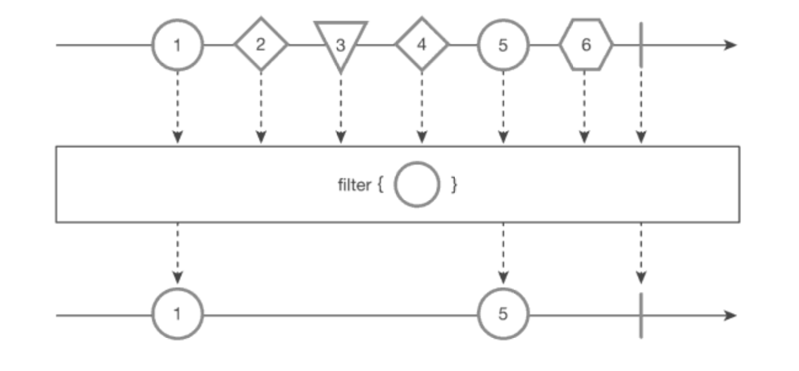

filter() 함수
===
* marblediagam
  * 
* ```java
  String[] objs = {"1 CIRCLE", 2 DIAMOND", "3 TRIANGLE", "4 DIAMOND", "5 CIRCLE", "6 HEXAGON"};
  Observable<String> source = Observable.fromArray(objs)
    .filter(obj -> obj.endsWith("CIRCLE"));
  source.subscribe(System.out::println);

  // result:
  // 1 CIRCLE
  // 5 CIRCLE

* boolean 값을 리턴하는 함수형 인터페이스인 Predicate( = 진위판별이라는뜻) 를 인자로 넣는다.
  * 람다 표현식으로 넣으면 Predicate인지 Function 인지 신경 쓰지 않고 동일하게 코딩 가능함
* 위의 코드에서 사용된 람다가 바로 Predicate타입의 함수이다.
  * Predicate<String> filterCircle = obj -> obj.endsWith("CIRCLE");

> 숫자 필터링 예제
* ```java
  Integer[] data = {100, 34, 27, 99, 50};
  Observable<Integer> source = Observable.fromArray(data)
    .filter(number -> number % 2 == 0);
  source.subscribe(System.out::println);

> 비슷한 함수들
* first(default)
  * 첫번째값만 필터
* last(default)
  * 마지막값만 필터
* **take(N) -> 중요**
  * 최초 N개값만 필터
* takeLast(N)
  * 마지막 N개값만 필터
* skip(N)
  * 최초 N개 후부터 필터
* skipLast(N)
  * 마지막 N개까지만 필터
* 예제코드
  * ```java
    Integer[] numbers = {100, 200, 300, 400, 500};
    Single<Integer> single;
    Observable<Integer> source;

    // 1. first -> 첫 번째 항목만 리턴
    single = Observable.fromArray(number).first(-1);
    single.subscribe(data -> System.out.println("first() value = " + data));

    // 2. last -> 마지막 항목만 리턴
    single = Observable.fronArray(numbers).last(999);
    single.subscribe(data -> System.out.println("last() value =" + data));
   
    // 3. take(N) -> 처음 N개
    source = Observable.fromArray(numbers).take(3);
    source.subscribe(data -> System.out.println("take(3) values =" + data));

    // 4. takeLast(N) -> 마지막 기준 N개
    source = Observable.fromArray(numbers).takeLast(3);
    source.subscribe(data -> System.out.println("takeLast(3) values =" + data));

    // 5. skip(N) -> 처음 N개 건너뛰고
    source = Observable.fromArray(numbers).skip(2);
    source.subscribe(data -> System.out.printlb("skip(2) values =" + data));

    // 6. skipLast(N) -> 마지막 N개는 건너뛰기
    source = Observable.fromArray(numbers).skipLast(2);
    source.subscribe(data -> System.out.println("skipLast(2) values =" + data));
 
    // result :
    // first() value = 100
    // last() value = 500
    // take(3) values = 100
    // take(3) values = 200
    // take(3) values = 300
    // takeLast(3) values = 300
    // takeLast(3) values = 400
    // takeLast(3) values = 500
    // skip(2) values = 300
    // skip(2) values = 400
    // skip(2) values = 500
    // skipLast(2) values = 100
    // skipLast(2) values = 200
    // skipLast(2) values = 300
