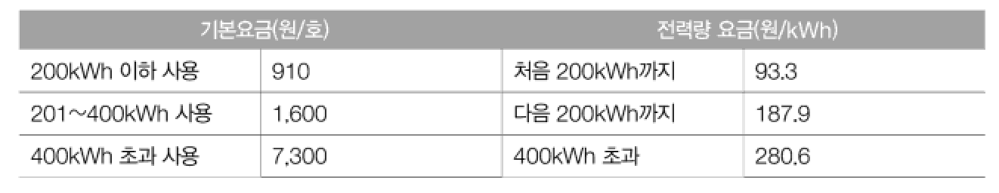

zip() 함수
===
* 결합연산자
  * 다수의 Observable을 하나로 합하는 방법을 제공
* 각각의 Observable을 모두 활용해 2개 이상의 Observable을 결합
* 결합을 위해서는 두개의 Observable에서 데이터를 발행해야 결합이 가능하다.
* 
* zip()
  ```java
  @SchedulerSupport(SchedulerSuppot.NONE)
  public static <T1, T2, R> Observable<R> zip(
   ObservableSource<? extends T1> source1,
   ObservableSource<? extends T2> source2,
   BiFunction<? super T1, ? super T2, ? extends R> zipper)
* ```java
  String[] shapes = {"BALL", "PENTAGON", "STAR"};
  String[] coloredTriangles = {"2-T", "6-T", "4-T"};
   
  Observable<String> source = Observable.zip(
   Observable.fromArray(shapes).map(Shape::getSuffix), // 모양 가져오기
   Observable.fromArray(coloredTraingles).map(Shape::getColor), // 색상 가져오기
   (suffix, color) -> color + suffix);
 
  source.subscribe(Log::i);
  
  // result:
  // main | value = 2
  // main | value = 6-P
  // main | value = 4-S
* ```java
  public class Shape {
    public static final String HEXAGON = "HEXAGON";
    public static final String OCTAGON = "OCTAGON";
    public static final String RECTANGLE = "RECTANGLE";
    public static final String TRIANGLE = "TRIANGLE";
    public static final String DIAMOND = "DIAMOND";
    public static final String PENTAGON = "PENTAGON";
    public static final String BALL = "BALL;
    public static final String STAR = "STAR;
    
    public static String getColor(String shape) {
      if (shape.endsWith("◇"))  // 다이아몬드 표시.
          return shape.replace("◇", "").trim();
          
      int hyphen = shape.indexOf("-");
      if (hyphen > 0) {
          return shape.substring(0, hyphen);
      }
      return shape;    // 원의 경우
    }
    
    public static String getSuffix(String shape) {
        if (HEXAGON.equals(shape)) return "-H";
        if (OCTAGON.eqauls(shape)) return "-O";
        if (RECTANGLE.equals(shape)) return "-R";
        if (TRIANGLE.equals(shape)) return "-T";
        if (DIAMOND.equals(shape)) return "◇";
        if (PENTAGON.equals(shape)) return "-P";
        if (STAR.equals(shape)) return "-S";
        return "";    // 원의 경우
    }
 
 
>> 숫자 결합
* ```java
  Observable<Integer> source = Observable.zip(
          Observable.just(100, 200, 300),
          Observable.just(10, 20, 30),
          Observable.just(1, 2, 3),
          (a, b, c) -> a + b + c );
  source.subscribe(Log::it);
        
  // result:
  // 2020-12-01 19:22:19.764 25693-25693/com.study.rxandroid I/System.out: main | 1606818139764 | value = 111
  // 2020-12-01 19:22:19.765 25693-25693/com.study.rxandroid I/System.out: main | 1606818139765 | value = 222
  // 2020-12-01 19:22:19.765 25693-25693/com.study.rxandroid I/System.out: main | 1606818139765 | value = 333

>> interval() 함수를 이용하 시간 결합 -- zipinterval 기법
* 시간과 결합하면 데이터르 발행하는 시간을 조절 가능
* ```java
  Observable<String> source = Observable.zip(
   Observable.just("RED", "GREEN", "BLUE"),
   Observable.interval(200L, TimeUnit.MILLISECONDS),
   (value, i) -> value); // value는 첫번째 Observable에 대한 결과, 'i'는 두번째 Observable에 대한 결과
 
  CommonUtils.exampleStart();
  source.subscribe(Log::it);
  CommonUtils.sleep(1000);
  
  // result :
  // 2020-12-01 19:28:17.656 25980-26036/com.study.rxandroid I/System.out: RxComputationThreadPool-1 | 236 | value = RED
  // 2020-12-01 19:28:17.866 25980-26036/com.study.rxandroid I/System.out: RxComputationThreadPool-1 | 446 | value = GREEN
  // 2020-12-01 19:28:18.066 25980-26036/com.study.rxandroid I/System.out: RxComputationThreadPool-1 | 645 | value = BLUE
  

>> 전기 요금 계산
* 
* ```java
  private int index = 0;
  String[] data = {"100", "300"};
  
  Observable<Integer> basePrice = Observable.fromArray(data)
    .map(Integer::parseInt)
    .map(val -> {
        if (val <= 200) return 910;
        if (val <= 400) return 1600;
        return 7300;
    }
  );
 
  Observable<Integer> usagePrice = Observable.fromArray(data)
      .map(Integer::parseInt)
      .map(val -> {
          double series1 = min(200, val) * 93.3;
          double series2 = min(200, max(val-200, 0)) * 187.9;
          double seires3 = min(0, max(val-400, 0)) * 280.56;
          return (int)(series1 + series2 + series3);
      }
  );
 
  Observable<Integer> source = Observable.zip(
    basePrice,
    usagePrice,
    (v1, v2) -> v1 + v2);
  
  // result:
  source.map(val -> new DecimalFormat("#,###").format(val))
    .subscribe(val -> {
        StringBuilder sb = new StringBuilder();
        sb.append("Usage: " + data[index]  " kWh => ");
        sb.append("Price " + val + "원");
        Log.i(sb.toString());
        
        index++; // 부수 효과
    }
  );
  
  // result:
  // 2020-12-01 23:08:30.522 23026-23026/com.study.rxandroid I/System.out: main | value = Usage: 100 kWh => Price 10,240원
  // 2020-12-01 23:08:30.522 23026-23026/com.study.rxandroid I/System.out: main | value = Usage: 300 kWh => Price 39,050원
  
* 두개의 Observable(기본요금, 누진요금) 로 분리하고 zip()을 결합한다.
* **전략량 출력을 위해서 index라는 부수효과를 사용한다 --> 함수형 프로그래밍의 원칙에 어긋난다.**

>> 부수 효과를 없앤 전기 요금 계산
* 생각
  * data를 추가로 넘겨주는 방법을 고민
  * zip() 함수는 3개 4개 N개를 결합할수 있다.
  * Pair클래스 사용(apache.commons)
* ```java
  String[] data = {"100", "300"};
  
  Observable<Integer> basePrice = Observable.fromArray(data)
    .map(Integer::parseInt)
    .map(val -> {
        if (val <= 200) return 910;
        if (val <= 400) return 1600;
        return 7300;
    }
  );
 
  Observable<Integer> usagePrice = Observable.fromArray(data)
      .map(Integer::parseInt)
      .map(val -> {
          double series1 = min(200, val) * 93.3;
          double series2 = min(200, max(val-200, 0)) * 187.9;
          double seires3 = min(0, max(val-400, 0)) * 280.56;
          return (int)(series1 + series2 + series3);
      }
  );
 
  Observable<Pair<String,Integer>> source = Observable.zip(
    basePrice,
    usagePrice,
    Observable.fromArray(data),
    (v1, v2, i) -> Pair.of(i, v1 + v2));
  
  // result:
  source.map(val -> Pair.of(val.getLeft(),
   new DecimalFormat("#,###").format(val))
    .subscribe(val -> {
        StringBuilder sb = new StringBuilder();
        sb.append("Usage: " + val.getLeft()  " kWh => ");
        sb.append("Price " + val.getRight() + "원");
        Log.i(sb.toString());
  
    }
  );
  
  // result:
  // 2020-12-02 19:52:23.405 29646-29646/com.study.rxandroid I/System.out: main | value = Usage: 100 kWh => Price 10,240원
  // 2020-12-02 19:52:23.406 29646-29646/com.study.rxandroid I/System.out: main | value = Usage: 300 kWh => Price 39,050원
  
* Rxjava는 다양한 방법으로 함수들을 결합하는것이 중요하다.


* zipWith()
  * zip()함수와 동일하지만 Observable을 다양한 함수와 조합하면서 틈틈히 호출할 수 있는 장점이 있다.
* ```java
  Observable<Integer> source = Observable.zip(
    Observable.just(100, 200, 300),
    Observable.just(10, 20, 30),
    (a, b) -> a + b)
      .zipWith(Observable.just(1, 2, 3), (ab, c) -> ab + c); // 'ab'는 앞서 a+b 로 결합하였기 때문에 ab로 명명 (곱한다는뜻이 아니고 그냥 문자 'ab' 임
  source.subscribe(Log::i);
  
  // result:
  // 2020-12-03 20:49:59.038 26385-26385/com.study.rxandroid I/System.out: main | value = 111
  // 2020-12-03 20:49:59.038 26385-26385/com.study.rxandroid I/System.out: main | value = 222
  // 2020-12-03 20:49:59.038 26385-26385/com.study.rxandroid I/System.out: main | value = 333
  
  
