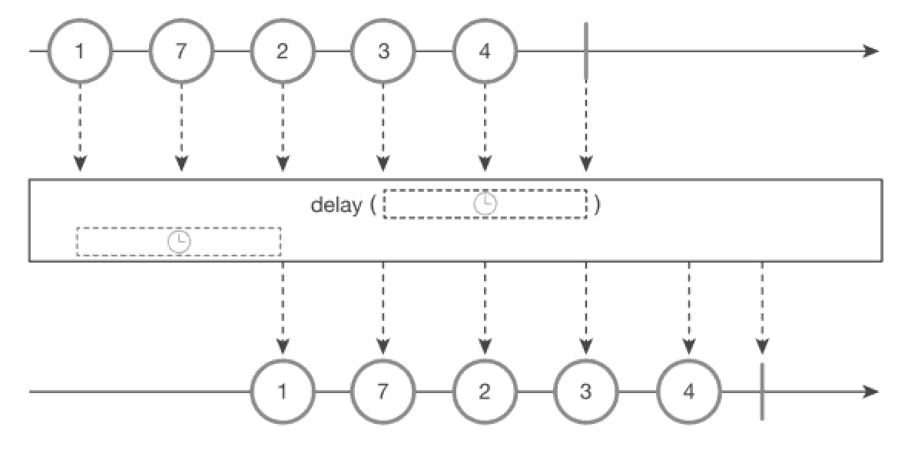

delay() 함수
===
* 주기적으로 시간으로 다루는 함수들..?
  * interval()
    * 주기적으로 Observable에서 값을 발행
  * timer()
    * 일정 시간이 지난 후 값을 발행
  * defer()
    * Callable 등록후 실행 지연
* 위 세가지 함수가 Observable을 생성하는 역할이라면 delay()는 유틸리티 연산자로서 보조 역할을 해준다.
* **단순하게 인자로 전달받은 time과 시간 단위(ms, m 등)만큼 입력받은 Observable의 데이터 발행을 지연시켜주는 역할을 합니다.**
* marblediagram
  
* ```java
  @SchedulerSupport(SchedulerSupport.COMPUTATION)
  public final Observable<T> delay(long delay, TimeUnit unit)
* ```java
  String[] data = {"1", "7", "2", "3", "4"};
  Observable<String> source = Observable.fromArray(data)
    .delay(100L, TimeUnit.MILLISECONDS);
  source.subscribe(Log::it);
  CommonUtils.sleep(1000);
 
  // result:
  // 2020-12-14 09:29:45.271 1160-2781/com.study.rxandroid I/System.out: RxComputationThreadPool-1 | 271 | value = 1
  // 2020-12-14 09:29:45.272 1160-2781/com.study.rxandroid I/System.out: RxComputationThreadPool-1 | 272 | value = 7
  // 2020-12-14 09:29:45.272 1160-2781/com.study.rxandroid I/System.out: RxComputationThreadPool-1 | 272 | value = 2
  // 2020-12-14 09:29:45.272 1160-2781/com.study.rxandroid I/System.out: RxComputationThreadPool-1 | 272 | value = 3
  // 2020-12-14 09:29:45.272 1160-2781/com.study.rxandroid I/System.out: RxComputationThreadPool-1 | 272 | value = 4


  // delay() 함수 없이 실행하면 시간은 100ms 줄어들고 메인에서 진행된다.
  // result:
  // 2020-12-14 09:29:45.271 1160-2781/com.study.rxandroid I/System.out: main | 171 | value = 1
  // 2020-12-14 09:29:45.272 1160-2781/com.study.rxandroid I/System.out: main | 172 | value = 7
  // 2020-12-14 09:29:45.272 1160-2781/com.study.rxandroid I/System.out: main | 172 | value = 2
  // 2020-12-14 09:29:45.272 1160-2781/com.study.rxandroid I/System.out: main | 172 | value = 3
  // 2020-12-14 09:29:45.272 1160-2781/com.study.rxandroid I/System.out: main | 172 | value = 4
