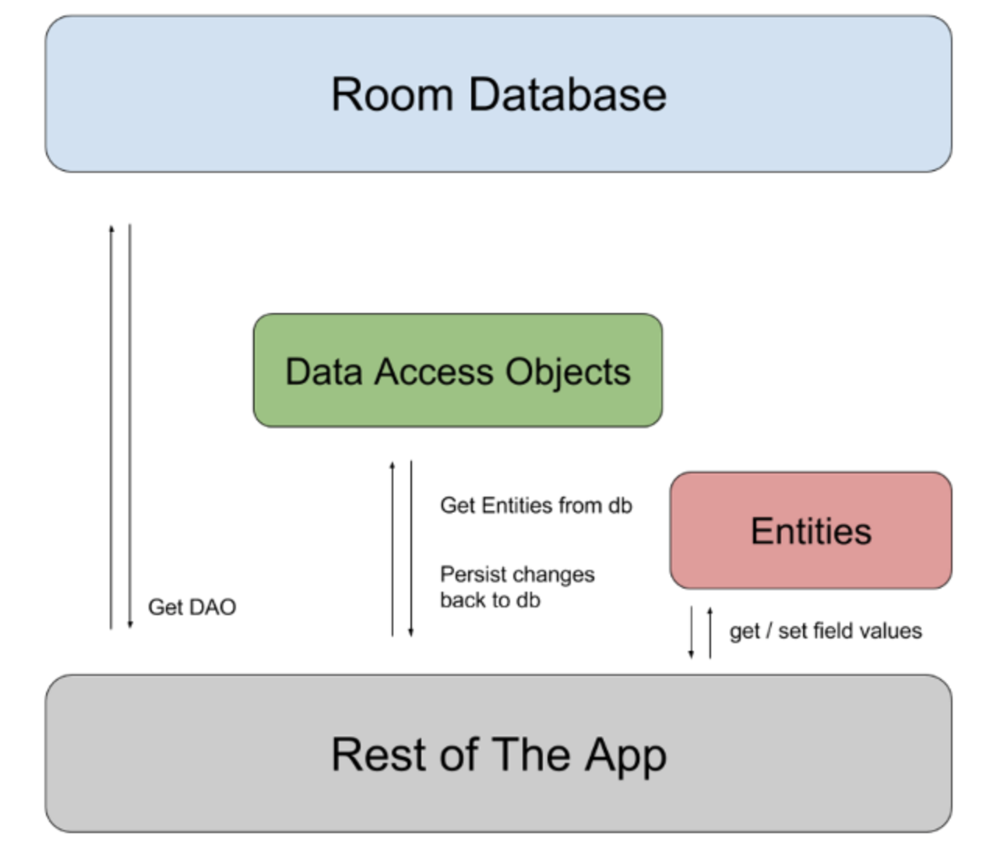

Room - [출처 - 안드로이드 공식문서](https://developer.android.com/training/data-storage/room?hl=ko), [출처 - 슬기로운-개발생활](https://medium.com/슬기로운-개발생활/안드로이드-room-사용법-1b7bd07b4ce)
---
* 구글에서 사용을 권장하는 Jetpack 에서 제공하는 DB 아키텍쳐로 db의 객체를 자바 또는 코틀린 객체로 매핑해준다.
* RoomDatabase 인스턴스는 리소스를 상당히 많이 소비하기에 디자인패턴을 따라야한다.
* allowMainThreadQueries()를 호출하지 않으면 Room은 기본 스레드에서 데이터베이스 액세스를 지원
* 
* 구성 요소
  * @Entity
    * 데이터베이스 내의 테이블을 나타냄
    * ```kotlin
      @Entity
      data class User(
          @PrimaryKey val uid: Int,
          @ColumnInfo(name = "first_name") val firstName: String?,
          @ColumnInfo(name = "last_name") val lastName: String?
      )
     
      @Entity(tableName = "history", indices = [Index(value = ["word"], unique = true)])
      class SearchKeyword(@ColumnInfo("word") val keyword: String) {
          @PrimaryKey(autoGenerate = true)
          var id: Long = 0
      }
    * tableName
      * 사용할 테이블 명 지정
    * @PrimaryKey(autoGenerate = true)
      * 설정하면 id를 autoIncrement 시켜준다.
    * @ColumnInfo
      * 해당 필드의 테이블 컬럼명 지정(미지정 시 해당 필드와 동일한 이름으로 컬럼 생성)
    * indices = [Index(value = ["테이블 컬럼명"], unique = true)
      * 해당 컬럼에 unique 설정
  * @Dao (나에게 데이터를 dao ..ㅋㅋ)
    * 데이터베이스에 접근하는 메서드
    * onConflict = OnConflictStrategy.REPLACE/ABORT/FAIL/IGNORE/ROLLBACK: 기본키 충돌 시, 처리 방식 설정 [링크]
    * 모든 쿼리는 분리된 스레드에서 실행
    * ```kotlin
      @Dao
      interface UserDao {
          @Query("SELECT * FROM user")
          fun getAll(): List<User>

          @Query("SELECT * FROM user WHERE uid IN (:userIds)")
          fun loadAllByIds(userIds: IntArray): List<User>

          @Query("SELECT * FROM user WHERE first_name LIKE :first AND " +
                 "last_name LIKE :last LIMIT 1")
          fun findByName(first: String, last: String): User

          @Insert
          fun insertAll(vararg users: User)

          @Delete
          fun delete(user: User)
      }
   
      interface BaseDao {
          @Insert(onConflict = OnConflictStrategy.REPLACE)
          fun insertEntity(vararg entity: T)

          @Delete
          fun deleteEntity(vararg entity: T)
      }

      @Dao
      interface SearchKeywordDao : BaseDao {
          @Query("SELECT * FROM history ORDER BY id DESC LIMIT 5")
          fun selectAllHistories(): List

          @Query("SELECT * FROM history WHERE id = :id ")
          fun selectHistory(id: Long): List
      }
  * @Database
    * RoomDatabase를 확장하는 추상 클래스
    * 주석 내에 데이터베이스와 연결된 항목의 목록을 포함
    * 데이터베이스 생성은 비용이 많이 들어가기 때문에 싱글톤으로 작성
    * 인수가 0개
    * ```kotlin
      @Database(entities = arrayOf(User::class), version = 1)
      abstract class AppDatabase : RoomDatabase() {
          abstract fun userDao(): UserDao // @Dao로 주석이 지정된 클래스를 반환하는 추상 메서드를 포함해야 한다.
      }
    * ```kotlin
      @Database(entities = [SearchKeyword::class], version = 1)
      abstract class SearchKeywordDB : RoomDatabase() {
      abstract fun dao(): SearchKeywordDao

      companion object {
          fun getInstance(context: Context): SearchKeywordDB {
              return Room.databaseBuilder(context.applicationContext, SearchKeywordDB::class.java, "search.db").fallbackToDestructiveMigration().build()
          }
        }
      }
      
* ```kotlin
  val db = Room.databaseBuilder(
              applicationContext,
              AppDatabase::class.java, "database-name"
          ).build()
* 

