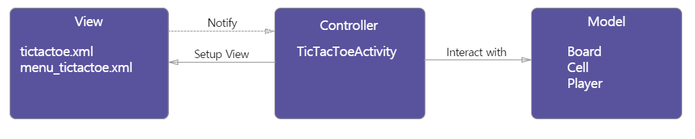
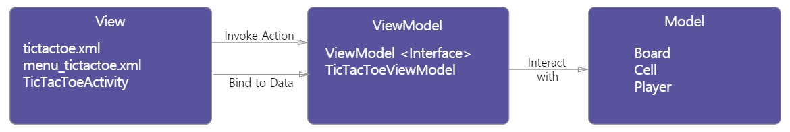

디자인패턴
===
디자인패턴의 종류
---
* MVC(Model-View-Controller)
* MVP(Model-View-Presenter)
* MVVM(Model-View-View Model)
* 역사적으로 본다면 MVC -> MVP -> MVVM 으로 등장했다.
* [유튜브 영상](https://youtu.be/bjVAVm3t5cQ)

# 예제코드 GitHUB -> [https://github.com/ericmaxwell2003/ticTacToe](https://github.com/ericmaxwell2003/ticTacToe)
MVC(★) - [출처](https://academy.realm.io/kr/posts/eric-maxwell-mvc-mvp-and-mvvm-on-android/)
---
* 
* 구성
  * Model
    * MVC,MVP,MVVM 전부 동일한 의미에서 데이터 + 상태 + 비즈니스 로직을 말하며 앱의 두뇌 역할을 뜻함
  * View
    * 아는것이 아무것도 없는 멍청한 역할 => 종속성 하락 => 변화 용이
  * Controller
    * 모델과 View를 이어주는 역할
    * 주로 액티비티나 프래그먼트로 표현됩니다. 한마디로 그냥 일반적으로 우리가 하는 안드로이드 프로그래밍이랑 매우 비슷
* 장점
  * 모델과 뷰를 분리하는것이 용이하고 뷰는 테스트하기가 용이
* 단점
  * 컨트룰러의 문제
    * 테스트 용이성
      * 컨트룰러가 안드로이드 API에 깊게 종속되어 유닛 테스트가 어렵다.
    * 모듈화 및 유연성
      * 뷰와 컨트룰러가 강하게 결합될수 있음
    * 유지 보수
      * **코드가 컨트룰러로 모이면서 코드가 비대해지며 문제가 많이 발생**
      
MVP(★★) - [출처](https://academy.realm.io/kr/posts/eric-maxwell-mvc-mvp-and-mvvm-on-android/)
---
* 
* 구성
  * Model
    * MVC,MVP,MVVM 전부 동일한 의미에서 데이터 + 상태 + 비즈니스 로직을 말하며 앱의 두뇌 역할을 뜻함
  * View
    * Activity와 Fragment가 전부 뷰의 일부로 포함
    * 액티비티가 뷰 인터페이스를 구현해서 프리젠터가 코드를 만들 인터페이스를 갖도록 하는 것이 좋음
  * Presenter
    * 뷰에 직접연결하는것이 아니라 인터페이스로 구성된다 => 테스트 가능성 + 모듈화 + 유연성 해결
    * MVP가 극단적으로 갈경우 어떤 안드로이드 API도 참고하면 안된다는 의견도 있음
* 코드 분석
  * 
* 장점
  * API연결이 안되어있어 테스트 용이
* 단점
  * MVC와 동일하게 프레젠터로 코드가 모이는 경향 => 유지보수 매우 힘듬
  
MVVM(★★★ - 매우 중요!!!) - [출처](https://academy.realm.io/kr/posts/eric-maxwell-mvc-mvp-and-mvvm-on-android/)
---
* 역할
  * view
    * 왕따이다. viewModel이랑 model이 신경조차 쓰지않는다. 아니.. 얘네들은 view가 존재하는지도 모른다. 하지만 view는 viewmodel 꼬랑지만 졸졸 따라댕기며 뭐 바뀌는거없나 계속 체크한다.
  * model, viewmodel
    * 서로 엉청나게 친하다. model은 값바뀌면 viewmodel한테 알려주고 viewmodel은 그에따라서 비즈니스로직을 수행한다. 이 둘은 서로의 존재만 알지 자기네들값을 view가 슬쩍 보는것도 모른다.
* [찰스의 안드로이드 유튜브 영사 앞부분 참고](https://www.youtube.com/watch?v=07ES0ne-_U8)
* 
* **뷰결합(데이터바인딩) : https://developer.android.com/topic/libraries/data-binding/index.html#java 을 사용하여서 하는것이 가장 큰 특징**
  * 아래는 tictactoe.xml 코드이다.
  * ```xml
    <data>
        <import type="android.view.View" />
        <variable name="viewModel" type="com.acme.tictactoe.viewmodel.TicTacToeViewModel" />
    </data>
    ...
    ...
    <Button
         style="@style/tictactoebutton"
         android:onClick="@{() -> viewModel.onClickedCellAt(0,0)}"
         android:text='@{viewModel.cells["00"]}' />
         
    <Button
         style="@style/tictactoebutton"
         android:onClick="@{() -> viewModel.onClickedCellAt(0,1)}"
         android:text='@{viewModel.cells["01"]}' />
    ...
    ...
    <LinearLayout
            android:id="@+id/winnerPlayerViewGroup"
            android:layout_width="wrap_content"
            android:layout_height="match_parent"
            android:gravity="center"
            android:orientation="vertical"
            android:visibility="@{viewModel.winner != null ? View.VISIBLE : View.GONE}"
            tools:visibility="visible">

            <TextView
                android:id="@+id/winnerPlayerLabel"
                android:layout_width="wrap_content"
                android:layout_height="wrap_content"
                android:layout_margin="20dp"
                android:textSize="40sp"
                android:text="@{viewModel.winner}"
                tools:text="X" />
   * **ViewModel은 어려운구조이며 많은 고민이 필요하다.**
   * ViewModel에는 다음과 같은 도구들이 필요 - [출처](https://thdev.tech/androiddev/2018/08/05/Android-Architecture-Components-ViewModel-Inject/)
     * DataBinding
     * Dagger2와 같은 DI(Dependency injection)
     * Rxjava
     * Koin (Kotlin 사용할경우)
   * 이러한것을 도와주는 도구로 AAC ViewModel과 LifeCycle을 잘 활용하여야 한다고함 - [[활용](https://thdev.tech/androiddev/2018/08/05/Android-Architecture-Components-ViewModel-Inject/)]
* 구성
  * Model
    * 데이터 저장, 수저, 삭제, 관리
    * 네트워크 통신 기타 등등
    * MVC,MVP,MVVM 전부 동일한 의미에서 데이터 + 상태 + 비즈니스 로직을 말하며 앱의 두뇌 역할을 뜻함 
  * View
    * UI 조작
    * 뷰모델에 의해 보여지는 Observable Variable , Action에 바인딩됨
  * ViewModel
    * View에 표현될 데이터를 Model 로 부터 가져와 가공하고 관리한ㄷ.
    * 뷰에 필요한 Observable Data를 준비
    * 모델을 래핑
    * 뷰가 모델에 이벤트를 전달할 수 있도록 hook(훅)을 준비
    * 뷰모델에 종속안됨
* 장점
  * 뷰에 대한 의존성이 없어 유닛 테스트가 용이
  * 테스트할때 모델이 변경되는 시점에 옵저버블 변수가 제대로 설정됐는지 확인하면 됨
* 단점
  * 뷰가 변수와 표현식 모두에 바인딩되어 프레젠테이션 로직이 늘어나 XML에 코드를 추가하게 될 수 있다.
    * 뷰 바인딩 표현식에서 값을 계산하거나 파생하지 말고 항상 뷰모델에서 직접 값을 가져오는 것이 중요
