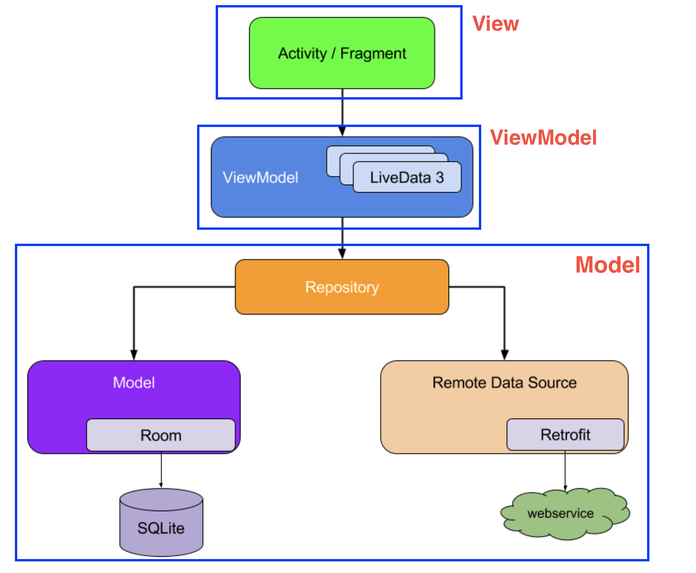

[아키텍쳐 가이드](https://developer.android.com/jetpack/guide?hl=ko)
===
* 앱 구성요소는 **개별적이고 비순차적으로 실행**될 수 있으며, 운영체제나 사용자가 언제든지 **앱 구성요소를 제거**할 수 있습니다. 
이러한 이벤트는 직접 제어할 수 없기 때문에 **앱 구성요소에 앱 데이터나 상태를 저장해서는 안 되며 앱 구성요소가 서로 종속되면 안 된다.**
* 안드로이드 MVVM 특징
  * view
    * 왕따이다. viewModel이랑 model이 신경조차 쓰지않는다. 아니.. 얘네들은 view가 존재하는지도 모른다. 하지만 view는 viewmodel 꼬랑지만 졸졸 따라댕기며 뭐 바뀌는거없나 계속 체크한다.
  * model, viewmodel
    * 서로 엉청나게 친하다. model은 값바뀌면 viewmodel한테 알려주고 viewmodel은 그에따라서 비즈니스로직을 수행한다. 이 둘은 서로의 존재만 알지 자기네들값을 view가 슬쩍 보는것도 모른다.

일반적인 아키텍쳐 - 당신이 앱을 만들때 지켜야하는것들
---
> 관심사 분리
* **UI 기반의 클래스는 UI 및 운영체제 상호작용을 처리하는 로직만 포함**
  * Activity 또는 Fragment에 모든 코드를 작성하는 실수는 흔히 일어난다.
> 모델에서 UI를 만들어야 한다
* Model
  * Model은 앱의 데이터 처리를 담당하는 구성요소
* 모델에서 UI를 만들어야 한다는 것입니다. 가급적 지속적인 모델을 권장

구글 권장 아키텍쳐 - 구글에서 권장하는 앱 아키텍쳐
---
* 일반적인 아키텍쳐를 따른다면 권장 아키텍쳐를 따르지 않아도된다.
* 
  * 이 설계는 일관되고 즐거운 사용자 환경을 제공합니다. 사용자가 앱을 마지막으로 닫은지 몇 분 후 또는 며칠 후에 다시 사용하는지와 관계없이 앱이 로컬에 보존하는 사용자의 정보가 바로 표시됩니다. 이 데이터가 오래된 경우 앱의 저장소 모듈이 백그라운드에서 데이터 업데이트를 시작합니다.

사용자 인터페이스 제작
---
* UI 구성 요소
  * Fragment
  * UserProfileFragment
  * user_profile_layout.xml
