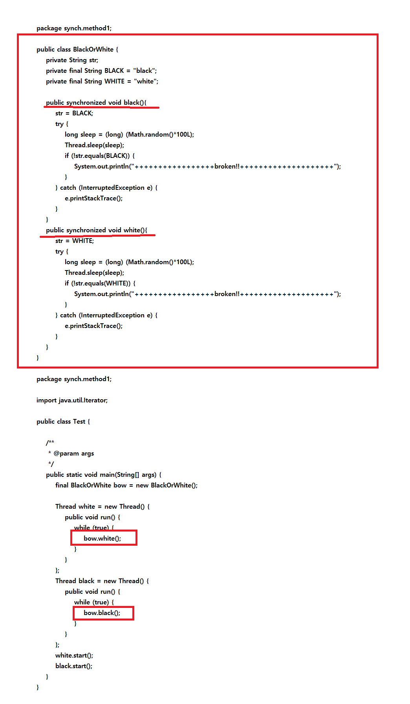

synchronized
===
* multi-thread로 동시접근되는것을 막는다는 개념
* 자세한 설명 참고 - [투덜이의 리얼 블로그](https://tourspace.tistory.com/54)
* ```java
  public synchronized void add() { 
    //Do something 
  } 
  // 위와 아래는 똑같다.
  public void add() { 
    synchronized(this) { 
      //Do something 
    } 
  }
* 
* broken은 절대 발생하지 않는다. 같은 인스턴스안에서 동기화가 진행됨
* 
* 같은 오브젝트로 Sync해주면 같은 오브젝트끼리만 동기화가 진행된다.
